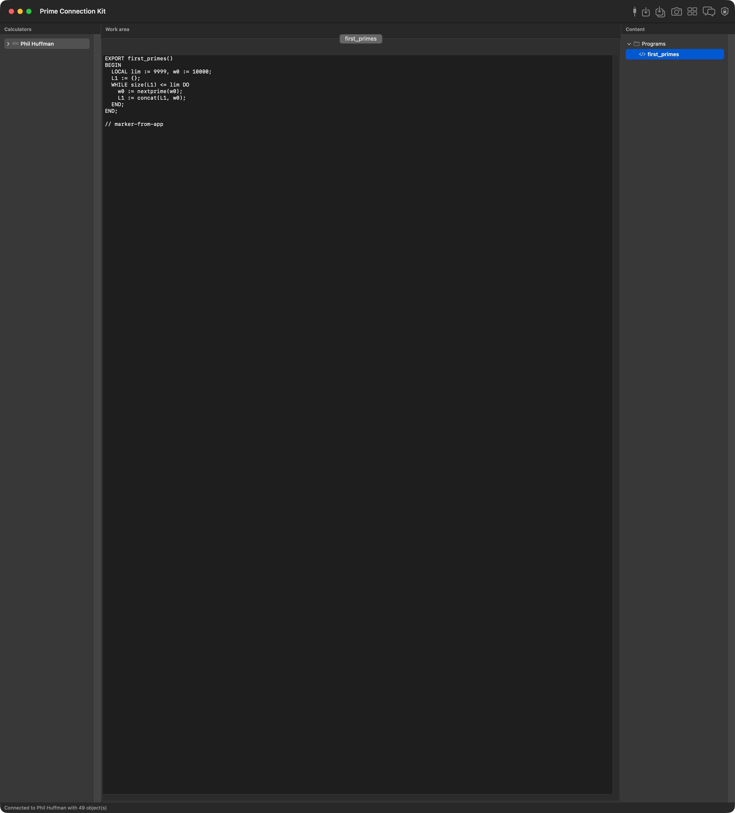
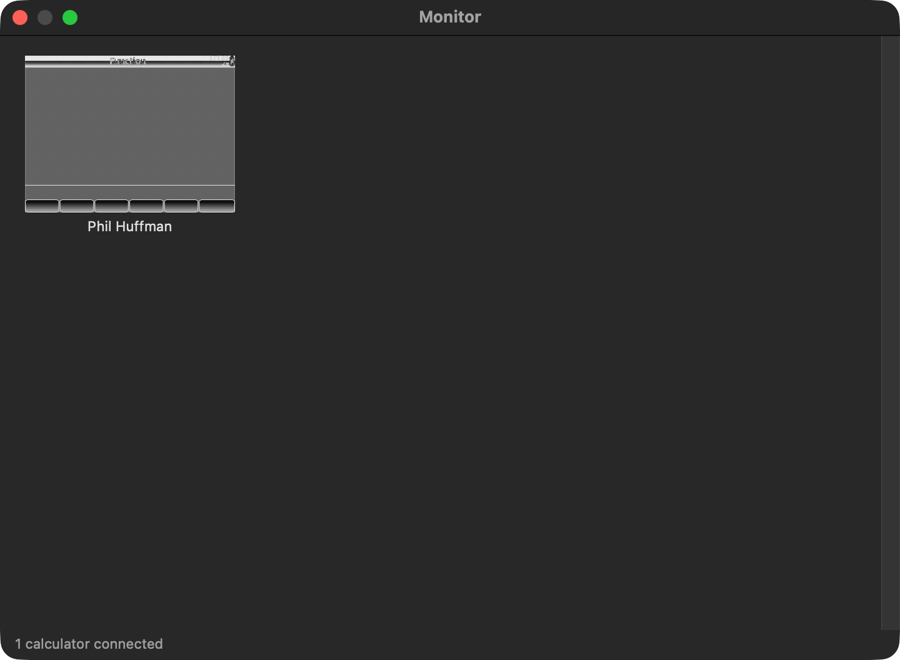

# Prime Connection Kit

A native macOS application that replaces HP Connectivity Kit for HP Prime graphing
calculators.

HP's Connectivity Kit is a Qt application whose macOS build is an Intel-only
binary. Prime Connection Kit reimplements the same job in Swift and AppKit: it
talks to a Prime over USB, reads and edits the calculator's content, mirrors that
content into the Connectivity Kit's own working folder, and provides the classroom
tools — screen capture, monitoring, messaging — that the Connectivity Kit offers.

It deliberately reuses HP's working folder rather than inventing its own, so the
two applications can be installed side by side and neither is surprised by the
other's files.


```
Sources/HPLink/            transport, wire protocol, content codecs, working folder
Sources/PrimeConnectionKit/ the AppKit application
Tests/HPLinkTests/         protocol and format tests, including real HP files
Scripts/build-app.sh       builds PrimeConnectionKit.app
Scripts/install-app.sh     builds and installs it into /Applications
Scripts/make-dmg.sh        packages it as a downloadable disk image
Scripts/notarize.sh        notarizes a disk image (needs a Developer ID)
Scripts/make-icon.swift    draws the app icon
Scripts/version.sh         the version, in one place
Docs/launch-checklist.md   what is left before announcing this
```

Licensed under the MIT licence; see `LICENSE`.

## Building

```
swift build                 # library, app and tests
swift test                  # 99 tests
./Scripts/build-app.sh      # produces build/PrimeConnectionKit.app
open build/PrimeConnectionKit.app
```

Requires macOS 14 or later, on Apple silicon, and Xcode 16 or later to build. The
released app is an arm64 build; building from source on an Intel Mac will produce
a working Intel binary, but none is published.

There are no third-party dependencies: the USB layer is built directly on IOKit's HID API, the backup format
uses `ditto`, and the icon is drawn with Core Graphics — all part of the system.

## Installing

**Build it from source.** This is the recommended way, and not only for the
obvious reason: an application you compile yourself is **never quarantined** by
macOS, so it opens without any warning at all. Quarantine is attached when a file
is downloaded, not when it is built.

```
git clone https://github.com/56phil/prime_connection_kit.git
cd prime_connection_kit
./Scripts/install-app.sh    # builds, installs to /Applications, verifies it
```

That needs Xcode 16 or later, which the audience for this tool tends to have
anyway.

**Or download a prebuilt copy** from **Releases** on the repository page. The
release workflow builds a disk image on every tag, so the latest release always
matches the latest tagged source. Be aware of what macOS will do with it:

```
./Scripts/make-dmg.sh       # produces build/PrimeConnectionKit-<version>.dmg
```

### Opening a downloaded copy

The app is signed **ad-hoc** — a valid signature for local execution, but with no
identity behind it and nothing for macOS to verify against, because notarization
requires a paid Developer ID certificate that is not available to this project.
(Ad-hoc is a deliberate choice rather than a limitation here: a development
certificate *is* installed, but it belongs to a team that has nothing to do with
this project, and its team identifier has no business appearing on a public
download.)

macOS therefore quarantines anything downloaded from the internet and refuses it:
the assessment returns `rejected` and the process is killed on launch. Verified on
this machine, not assumed.

To open it, clear the quarantine attribute after dragging the app to Applications:

```sh
xattr -d "com.apple.quarantine" "/Applications/PrimeConnectionKit.app"
```

Or launch it once, let it be refused, then allow it under **System Settings →
Privacy & Security → Open Anyway**. Right-clicking the app and choosing *Open* does
not bypass this on current macOS versions.

With a Developer ID certificate installed, `Scripts/notarize.sh` notarizes and
staples the image, after which it opens with no warning at all.

### Either way

The install script refuses to replace a running copy, and checks the signature of
what it actually installed rather than of what it built. There is no driver to
install and no kernel extension: the app reaches the calculator through IOKit HID,
which macOS already provides, so the only setup is the Input Monitoring permission
below. HP's Connectivity Kit can stay installed alongside it.

### Releasing

Pushing a tag builds the disk image and publishes it as a release, provided the tag
matches `Scripts/version.sh`:

```
./Scripts/make-dmg.sh                    # check it builds
source Scripts/version.sh                # the tag must match this version
git tag "v$VERSION" && git push origin "v$VERSION"
```

To have CI sign the build, add two repository secrets: `MACOS_CERTIFICATE_BASE64`
(the **Developer ID Application** certificate exported as a `.p12`, base64-encoded)
and `MACOS_CERTIFICATE_PASSWORD` (the password given to that export). Without them
the workflow still publishes, but signed ad-hoc, and the release notes say so.

Notarizing that build too needs three more: `MACOS_NOTARY_APPLE_ID`,
`MACOS_NOTARY_TEAM_ID`, and `MACOS_NOTARY_PASSWORD`. The password is an
**app-specific** one from appleid.apple.com, not the account password. With all five
present the workflow signs with the Developer ID, notarizes, staples, and the release
notes describe the notarized case instead of the quarantine warning.

**The first launch asks for Input Monitoring permission.** macOS requires it before
any application may open a USB HID device. Grant it under System Settings →
Privacy & Security → Input Monitoring, then quit and reopen the app. Until it is
granted the app reports that the calculator could not be opened, rather than
failing quietly.

### The icon

The app ships no binary assets, so its icon is drawn from vector geometry by
`Scripts/make-icon.swift` and packaged into an `.icns` during the build. Each size
macOS asks for is rendered natively rather than downsampled from one large bitmap,
and the glyph carries less detail as it gets smaller — a sixteen-key grid at 16
pixels antialiases into grey mush, so the small variants show the display and a
colour band instead.

`Scripts/verify-icon.swift` checks that macOS is really showing that artwork, by
comparing the icon Launch Services returns for the bundle against the icon it
returns for a bundle with no icon at all. That catches the failure a file-existence
check cannot: an `.icns` present but not picked up, which leaves the Dock showing
the generic placeholder.

```
swift Scripts/make-icon.swift --out build --preview preview.png    # contact sheet
swift Scripts/make-icon.swift --out build --magnify magnified.png  # 16px and 32px
swift Scripts/verify-icon.swift /Applications/PrimeConnectionKit.app
```

## Verified against hardware

The implementation has been exercised against a real HP Prime attached by USB:
an `0x2441` device reporting firmware `V2.060.650`, serial `SN00000001`, with a
1024-byte HID report descriptor.

Working, end to end, on that calculator:

- **Connecting** — the app opens the device, reads its identity, and mirrors its
  contents. A full calculator returns **51 objects** in roughly twenty seconds.
- **Reading** — the backup stream returns every object with its real name. A
  program read from the calculator displays correctly in the editor.
- **Writing** — an object sent to the calculator appears in the next backup; the
  write was confirmed by listing the contents before and after.
- **Screen capture** — a valid 320×240 PNG.
- **Mirroring** — the working folder is populated with the calculator's content,
  and the application containers written there match HP Connectivity Kit's own
  output in their leading bytes.

Four protocol details differ from every published source, and each was established
by measurement. Every one of them would have made a reachable calculator look
broken:

| Detail | Published sources | Measured |
|---|---|---|
| Report size | 64 bytes | **1024 bytes** |
| Readiness reply | echoes `0xFF` | **`'Y'` (`0x59`)** |
| Write acknowledgement | a reply is sent | **nothing is sent** |
| Program transfer payload | the `.hpprgm` container | **the raw UTF-16 text** |

The acknowledgement matters because waiting for a reply that never comes turns a
successful write into a reported failure. The app treats silence as success only
when the link itself is healthy, and still reports a refusal.

The payload form matters more. The calculator stores a program transfer as *text*
and terminates on a NUL, so sending the `.hpprgm` container makes it keep only the
leading UTF-16 units. The evidence is exact: a container beginning `14 00 00 00`
was stored as four bytes, and HP's own file beginning `7C 61 8A B2 FE FF FF FF 00 00`
was stored as ten — in both cases precisely the units before the first zero byte.
Sending the source text instead round-trips a 1378-character program intact across
three reports.

That fault was not hypothetical. It was found by writing programs to a real
calculator and reading them back: three real programs were overwritten with
truncated content, and all three were restored from the Connectivity Kit's mirror
once the cause was known. `libhpcalcs`' README notes from the other direction that
"the leading metadata of `*.hpprgm`, if any, needs to be stripped manually"; the
container turns out to be the disk form, which the calculator builds itself.

The `PrimeProbe` target runs these checks on demand. `--experiment` compares the
two payload forms against the attached calculator directly.

A fifth finding concerns application containers. Firmware sends them with a short
prefix ahead of the container magic (`00 00 05 A5` before `7C 61 8A B2`), which the
Connectivity Kit strips and the app now strips too — so both applications produce
the same file on disk. The app preserves the container in full, where the
Connectivity Kit trims a few trailing bytes; the app's copy is a superset, never a
truncation.

One more was found by watching the application rather than the protocol: the
device-information reply arrives as *name, version, serial*, and taking the last
text token — the obvious first guess — picks the serial. That labelled the
calculator `SN00000001` and renamed its working folder to match. The name is now
identified by excluding the version and the serial.

```
swift run PrimeProbe                # enumerate, then exercise the link
swift run PrimeProbe --skip-write   # read-only checks
swift run PrimeProbe --framing 64   # force the older framing
swift run PrimeProbe --experiment   # compare program payload forms
```

## What works

### Connecting

Calculators are discovered by their USB identifiers (HP vendor `0x03F0`; product
`0x0441` and `0x1541` on early firmware, `0x2441` on current hardware). The report
size is read from each device's own HID descriptor rather than assumed, because
the two framings are not interchangeable. The device list is polled so plugging a
calculator in makes it appear. On connecting, the app probes the calculator, reads
its identity, and mirrors its content into the working folder.

The protocol work blocks on the USB link, so it runs off the main actor. That is
not a refinement: an earlier version read the Home variables by name, which costs a
multi-second timeout for each of fifty-seven names the calculator does not hold,
and froze the window for minutes. The backup stream replaced it — one request
returns everything, and a miss against the short-timeout fallback is cheap.

macOS gates access to HID devices behind the Input Monitoring permission. The
first connection attempt triggers a prompt; if communication fails with an
authorisation error, grant the app permission under System Settings → Privacy &
Security → Input Monitoring.

### Content editing



Each content type has an editor in the work area, opened by double-clicking an
object or using File → Open:

| Content | Editor | Round-trips |
|---|---|---|
| Real variables | key–value grid | yes |
| Complex variables | key–value grid | yes |
| Lists | numeric grid | yes |
| Matrices | numeric grid with add/remove row and column | yes |
| Programs | source text view | yes |
| Notes and app Info notes | text view | yes, formatting preserved |
| Applications | read-only summary | container preserved byte-for-byte |
| Exam configurations | name and restrictions summary | trailer preserved |

Three layout rules follow from how AppKit sizes these views, and each was a real
defect rather than a matter of taste. They are recorded here because none of them
fails loudly — the views still report their content through the accessibility layer
while being unusable on screen.

* A tab's view is sized by `NSTabView` from its **frame**, so an editor container
  must keep its autoresizing mask and let constraints flow from that frame into the
  content. Giving the container constraints and turning the mask off leaves it with
  no frame to start from, and the editor collapses to zero width: the tab opens
  empty and there is nothing to type into.
* `NSScrollView` never sizes its document. A text view left to itself grows to fit
  its text, so a paragraph is clipped at the pane's edge instead of wrapping. Its
  width is pinned to the scroll view's content view with a constraint, with a
  minimum height so clicking below the last line still places the caret.
* The split view's panes are sized by constraints, not by `setPosition`.
  `setPosition` measures against `splitView.bounds`, which is zero until the split
  view is laid out, so the second divider was placed at `0 - 250` and the work area
  collapsed to a sliver while the space went to the Content pane.

### Calculator operations

Backup, restore, clone, clear, rename (local folder), screen capture, setting the
clock, and messaging — all reachable from the calculator's context menu.

Save follows the Connectivity Kit's rule: an object is written back to wherever it
was opened from, so a program opened from a calculator is sent to that calculator
and mirrored here, while one opened from the content pane is written to this
computer. An object whose calculator has since been disconnected is kept locally
and the app says so.

### Classroom tools



The Monitor window shows a thumbnail per connected calculator and refreshes them
on a timer. A thumbnail's context menu saves or copies the capture, projects the
display live in its own window, sends a message, and clears a help flag. The
Messages window sends to the selection or the whole class, and the Proctor Mode
pane applies an exam configuration to calculators as they connect.

### Content organisation

Objects can be dragged between the calculator pane and the content pane, or from
Finder into either. The Monitor window accepts content dropped onto it to
distribute to the class.

## The formats it speaks

Everything the app does rests on file and wire formats that are not published by
HP. The implementations here come from the surviving public reverse-engineering
work — chiefly Lionel Debroux's `hplp` (`libhpcalcs`) for the link protocol and
Ian Gebbie's QtHPConnect and Erwin Ried's PrimeComm for the file layouts — and
were verified against real files rather than accepted on description. Where the
sources disagree, the app follows what the samples on disk actually contain.

| Format | How it is handled | Verified against |
|---|---|---|
| Link protocol | report framing, chunk sequence, message headers, CRC-16 | `libhpcalcs`'s tables and framing rules |
| `.hpprgm` | plain named/unnamed layouts decoded and re-encoded | byte-exact round trip of a real 790-byte program |
| `.hpnote`, `.hpappnote` | plain text extracted; formatted section preserved verbatim | a real app note |
| `.hplist` | 16-byte packed-decimal elements, complex pairs | round-trip property tests |
| `.hpmat` | compact 8-byte elements, real and complex matrices | round-trip property tests |
| `.hpapp`, `.hpappdir` | read for display; container bytes never rewritten | real application containers |
| `.hpexammode` | name and flags parsed; integrity trailer preserved | the Connectivity Kit's own configurations |

Three properties are worth stating explicitly, because they are choices rather
than accidents:

**Unchanged bytes stay unchanged.** An application container has no public
specification, so the app never rewrites one. Editing a note rebuilds only the
plain-text prefix and carries the formatted section over untouched, so bolding,
colours and embedded pictures cannot be lost.

**Unknown values are reported, not invented.** The numeric formats are packed
decimal rather than IEEE 754. The only public implementations disagree with
themselves about parts of the layout, so the encoder and decoder here are written
to agree with each other and are pinned by round-trip tests. The tag bytes inside
list elements are preserved from the file being edited rather than regenerated.

**Limits are surfaced in the interface.** Where the app cannot do something
faithfully, the editor says so above its content instead of silently producing a
file the calculator would reject.

## Known gaps

These are real limitations, not omissions from this document.

- **Firmware updating is not implemented.** It needs the calculator's mass-storage
  reflashing mode, a different protocol from the HID link this app speaks. HP's
  own note that updating requires a Windows PC in some versions applies here too.
- **Objects cannot be deleted from a calculator.** The link protocol has no delete
  command, and writing an empty body does not remove an object either — the
  calculator keeps it as an empty program. Content that is no longer wanted has to
  be removed on the calculator itself. Removing an object in the app affects this
  computer's copy, and the app says which of the two it did.
- **Mirroring is additive, so it does not prune.** Connecting writes a file for
  every object the calculator reports, but never removes the file of an object that
  has gone. Delete something on the calculator and its file stays here, which is a
  surprise precisely because the calculator pane shows the device's real contents
  when attached — the stale file is only visible in the Content pane or in Finder.

  This is deliberate rather than an oversight. Deciding that a file is stale means
  trusting `deviceObjects` to be a complete inventory, and the two cases are not
  distinguishable from the folder alone: a file absent from an *attached*
  calculator's object list looks exactly like a file belonging to a calculator that
  is merely *offline*, where deleting it would destroy an author's only copy.
  Getting this right needs a record of which objects this session actually saw,
  and a backup taken before anything is removed. Until then the app leaves the
  files alone and this note says so, rather than deleting content on a guess.
- **Exam-mode restrictions cannot be authored.** The calculator validates a
  configuration against a trailer that no public source documents. A configuration
  read from a working file keeps its trailer and can be renamed, but its
  restriction flags cannot be recomputed, and a configuration built from nothing
  will not be accepted by a calculator. The Proctor Mode pane applies existing
  configurations, which is the useful case.
- **Renaming a calculator changes the local folder only.** The name shown on the
  calculator lives in its Home Settings, which the app writes through a settings
  object whose layout is not public. The app says so rather than pretending the
  rename succeeded.
- **The wireless classroom network is not driven.** That hardware is a USB serial
  adapter with its own protocol; only calculators that also appear as USB HID
  devices are discovered.
- **`getInfos` field semantics are unknown.** The reply is kept verbatim and
  printable strings are extracted heuristically, so the Properties dialog shows
  what can be read reliably and the raw reply size.
- **The Monitor window does not receive polls.** The poll and results formats
  (`.hppoll`, `.hpresult`) are undocumented in every public source, so there is no
  poll editor and no results aggregation.
- **Applications' settings are read-only.** Modes, Symbolic, Plot and Numeric
  values live inside the undocumented container. Changing them on the calculator
  and reading the application back works; editing them here does not.

## Tests

`swift test` runs 99 tests in eight suites:

- **CRC-16** — the generated table pinned against rows transcribed from the
  reference implementation, plus a published test vector.
- **Packet framing** — fragmentation, the terminating short report, sequence
  wrapping past the reserved value, reassembly, and rejection of gaps and
  implausible lengths.
- **Number encoding** — round-trip properties for both packed-decimal widths,
  byte layout, and the text formatting used by the editors.
- **Content formats** — the codecs against real files, including a byte-exact
  program round trip and the note formatting-preservation guarantee.
- **Session protocol** — the whole stack driven through a scripted calculator:
  readiness, device information, screenshots, file transfer, backup streaming,
  checksum rejection, and byte-order-mark stripping.
- **Working folder** — the on-disk layout, the `&` marking rules, deletion rules
  and backup listing, in temporary directories.
- **Real Connectivity Kit folder** — reads the working folder HP's Connectivity
  Kit left on this machine and parses every object in it. Skipped when that folder
  is absent.

The unit tests drive the whole protocol through a scripted calculator, so they need
no hardware. They cannot, however, confirm that a real calculator accepts what the
app sends — several protocol details only reveal themselves on a device, and the
findings above came from measurement rather than from the tests. `PrimeProbe` exists
for that: it exercises the link against attached hardware and reports what actually
happened.

    swift run PrimeProbe                # enumerate, then exercise the link
    swift run PrimeProbe --skip-write   # read-only checks
    swift run PrimeProbe --experiment   # compare program payload forms
    swift run PrimeProbe --dump-names   # exact object names the device reports

`PRIME_CONNECTION_KIT_DEMO=1` opens the app with sample content already loaded,
which is how the interface can be exercised without a calculator attached.
